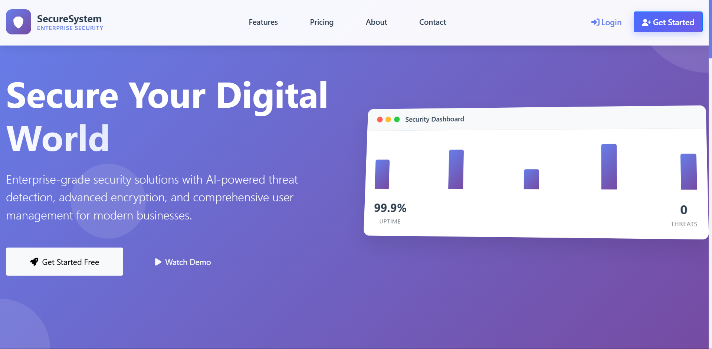
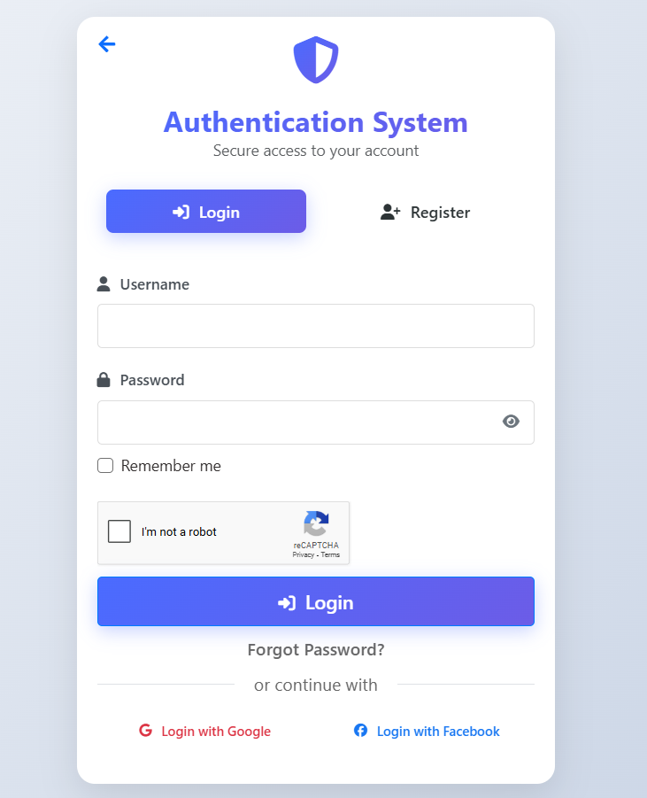
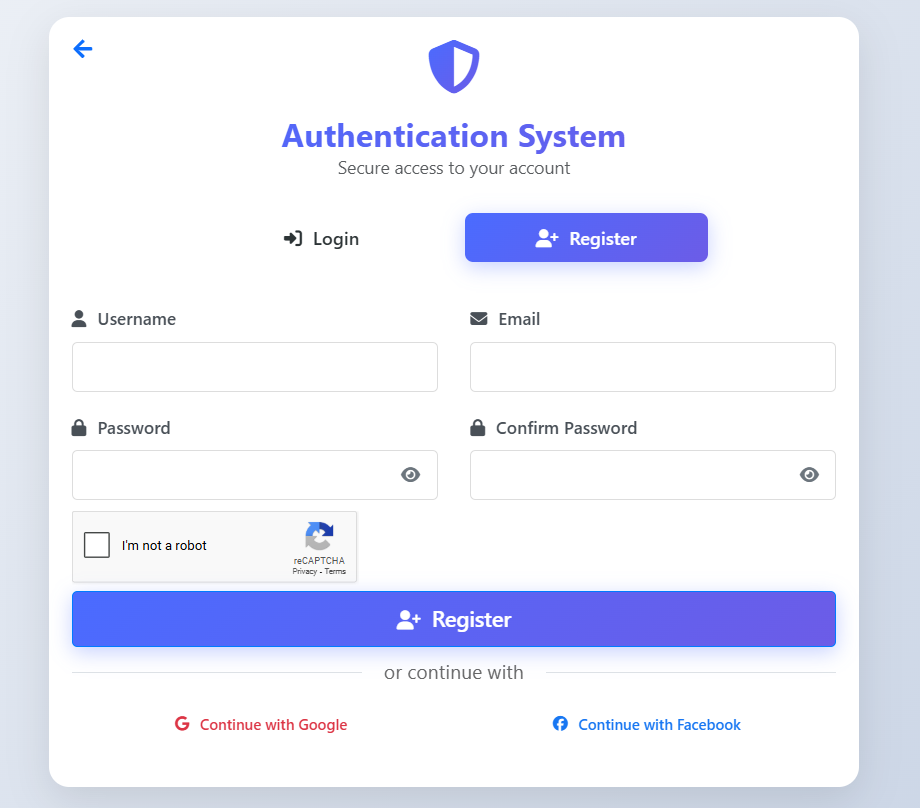
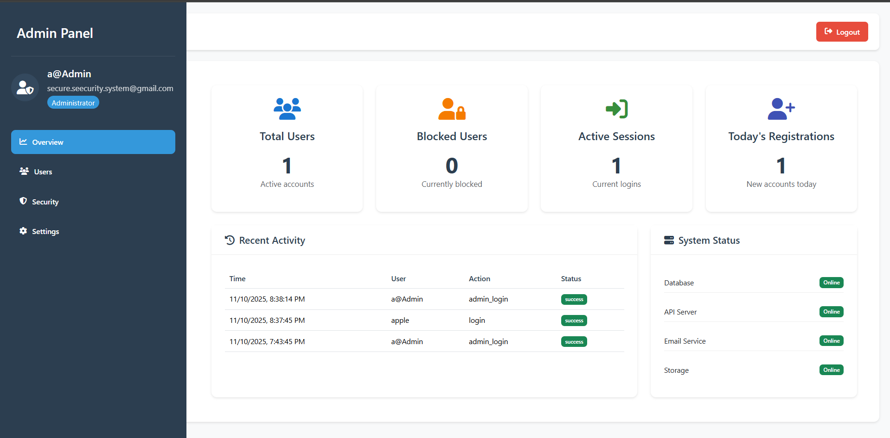
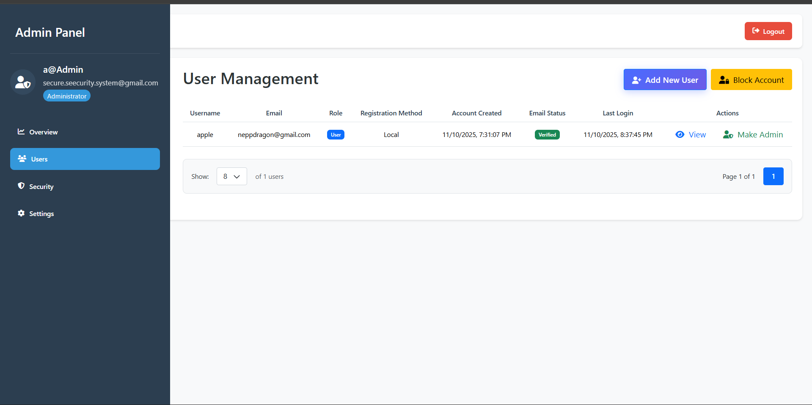

# 🛡️ SecureSystem - Enterprise Security Management System

<div align="center">

[](https://github.com/Ar-jun-fs9/security-system/releases)
[](https://opensource.org/licenses/MIT)
[](https://nodejs.org/)
[](https://reactjs.org/)
[](https://www.postgresql.org/)

**A comprehensive, enterprise-grade security management system built with modern web technologies.**

[🚀 Live Demo](#) • [📖 Documentation](#) • [🐛 Report Bug](https://github.com/yourusername/security-system/issues) • [✨ Request Feature](https://github.com/yourusername/security-system/issues)

</div>

## few Screenshot






---

## ✨ Features

### 🔐 Authentication & Authorization

- **Secure User Registration** with email verification
- **Multi-factor Authentication** support
- **JWT-based Authentication** with secure token management
- **Role-based Access Control** (User/Admin)
- **Password Reset** via email/OTP
- **Account Lockout** after failed attempts

### 👥 User Management

- **Profile Management** with update capabilities
- **User Dashboard** for account overview
- **Admin Panel** for comprehensive user management
- **User Blocking/Unblocking** functionality
- **Bulk User Operations** support

### 📊 Analytics & Monitoring

- **Real-time Security Analytics** dashboard
- **Audit Logging** for all critical actions
- **Login History** tracking
- **System Status** monitoring
- **User Activity** reports

### 🛡️ Security Features

- **Advanced Password Policies** with strength validation
- **reCAPTCHA Integration** for bot protection
- **Rate Limiting** and DDoS protection
- **Data Encryption** at rest and in transit
- **SQL Injection Prevention**
- **XSS Protection**

### 🎨 Modern UI/UX

- **Responsive Design** for all devices
- **Modern Material Design** interface
- **Dark/Light Theme** support
- **Smooth Animations** and transitions
- **Accessibility Compliant** (WCAG 2.1)

---

## 🛠️ Tech Stack

### Frontend

```json
{
  "React": "19.1.0",
  "Vite": "6.3.5",
  "React Router": "7.6.1",
  "Bootstrap": "5.3.6",
  "FontAwesome": "6.7.2",
  "Axios": "1.9.0"
}
```

### Backend

```json
{
  "Node.js": "18+",
  "Express.js": "4.18.2",
  "PostgreSQL": "13+",
  "JWT": "9.0.2",
  "Argon2": "0.31.2",
  "Nodemailer": "7.0.3"
}
```

### DevOps & Tools

- **ESLint** for code linting
- **Vite** for fast development and building
- **Nodemon** for backend development
- **Git** for version control

---

## 🚀 Quick Start or Installation

> ⚠️ **Prerequisites**: Node.js 18+, PostgreSQL 13+, Git

```bash
# Clone the repository
git clone https://github.com/Ar-jun-fs9/security-system.git
cd security-system

# Install dependencies
npm install
cd server && npm install && cd ..

# Setup environment variables
# Create a .env file inside the server folder
# Configure your database, email, and security keys in the .env file

# Example .env configuration
DB_USER=postgres
DB_HOST=localhost
DB_NAME=Security-System
DB_PASSWORD=your_password_here
DB_PORT=5432
FRONTEND_URL=http://localhost:5173

# Email Configuration
GMAIL_USER=your_email@gmail.com
GMAIL_APP_PASSWORD=your_app_password

# Security Keys
ENCRYPTION_KEY=your_encryption_key_here
JWT_SECRET=your_jwt_secret_here

# Server Configuration
PORT=5000
NODE_ENV=development

# Setup database
# 1. Create database named Security-System
# 2. Go to Security-System/src/components/store/
# 3. Run schema.sql on your PostgreSQL query tool
#    (Ensure to provide username, email, and Argon2id encrypted password)
#    Generate Argon2id encrypted passwords here: https://argon2.online/
# 4. Run triggers.sql after schema.sql

# Start the application
npm run dev

```

Visit [http://localhost:5173](http://localhost:5173) to access the application!

---

## ⚙️ Configuration

### Frontend Setup (ReCAPTCHA)

Add your ReCAPTCHA site key in your authentication components:

```jsx
// login.jsx
<div className="mb-4 recaptcha-container">
  <ReCAPTCHA
    ref={recaptchaRef}
    sitekey="your_site_key_here"
    onChange={handleCaptchaChange}
  />
</div>

// register.jsx
<div className="mb-4 recaptcha-container">
  <ReCAPTCHA
    sitekey="your_site_key_here"
    onChange={handleCaptchaChange}
  />
</div>


```

### Backend Environment Variables (server/.env)

```env
# Database Configuration
DB_HOST=localhost
DB_PORT=5432
DB_NAME=Security-System
DB_USER=your_db_user
DB_PASSWORD=your_db_password

# JWT Configuration
JWT_SECRET=your_super_secret_jwt_key
JWT_EXPIRES_IN=24h

# Email Configuration
EMAIL_HOST=smtp.gmail.com
EMAIL_PORT=587
EMAIL_USER=your_email@gmail.com
EMAIL_PASS=your_app_password

# reCAPTCHA Configuration
RECAPTCHA_SECRET_KEY=your_recaptcha_secret_key

# Application Settings
NODE_ENV=development
PORT=5000
```

---

## 🗄️ Database Setup

### PostgreSQL Setup

```sql
-- Create database
CREATE DATABASE Security-System;

```

### Database Tables

- `admin_users` - Admin accounts and roles
- `user_register` - User registration and profiles
- `user_login` - User login tracking
- `forgot_password` - Password reset requests
- `added_user_by_admin` - Users added by admin
- `deleted_user_by_admin` - Users deleted by admin
- `login_attempts` - Failed login attempts and blocking info
- `otp_verification` - OTP codes for verification
- `password_history` - User password history
- `profile_update_history` - Track changes in user profiles
- `audit_log` - Security event logging

---

## 📁 Project Structure

```
security-system/
├── 📁 public/                    # Static assets
│   ├── 📁 assets/               # Compiled assets
│   ├── 📁 collections/          # Password collections
│   └── 📄 index.html            # Main HTML file
├── 📁 server/                   # Backend application
│   ├── 📁 config/              # Configuration files
│   ├── 📁 middleware/          # Express middleware
│   ├── 📁 routes/              # API routes
│   ├── 📄 .env                 # enviroment Variables
│   ├── 📄 server.js            # Main server file
│   └── 📄 package.json         # Backend dependencies
├── 📁 src/                     # Frontend application
│   ├── 📁 components/          # React components
│   │   ├── 📁 Admin/          # Admin dashboard
│   │   ├── 📁 Auth/           # Authentication
│   │   ├── 📁 Dashboard/      # User dashboard
│   │   ├── 📁 home/           # Landing page
│   │   └── 📁 Common/         # Shared components
│   ├── 📁 services/           # API services
│   ├── 📄 App.jsx             # Main App component
│   ├── 📄 main.jsx            # Application entry
│   └── 📄 index.css           # Global styles
├── 📄 package.json             # Frontend dependencies
├── 📄 vite.config.js           # Vite configuration
├── 📄 README.md                # Project documentation
└── 📄 .gitignore              # Git ignore rules
```

---

## 🔐 Security Features

### Password Security

- **Argon2 Hashing** for password storage
- **zxcvbn Library** for password strength validation
- **Common Password Detection** using NBP library
- **Sequential Character Detection**
- **Repeated Character Prevention**

### Authentication Security

- **JWT Tokens** with secure signing
- **Token Expiration** and refresh mechanisms
- **Account Lockout** after failed attempts
- **Session Management** with timeout
- **Secure Cookie Settings**

### Data Protection

- **Input Validation** and sanitization
- **SQL Injection Prevention** with parameterized queries
- **XSS Protection** with content security policies
- **Rate Limiting** on API endpoints
- **Data Encryption** for sensitive information

---

## 📊 API Documentation

### Authentication Endpoints

```
POST   /api/auth/register          # User registration
POST   /api/auth/login             # User login
POST   /api/auth/logout            # User logout
POST   /api/auth/verify-email      # Email verification
POST   /api/auth/forgot-password   # Password reset request
POST   /api/auth/reset-password    # Password reset
```

### User Management Endpoints

```
GET    /api/users/profile          # Get user profile
PUT    /api/users/profile          # Update user profile
GET    /api/users/dashboard        # Get dashboard data
```

### Admin Endpoints

```
GET    /api/admin/users             # Get all users
POST   /api/admin/users             # Create new user
PUT    /api/admin/users/:id         # Update user
DELETE /api/admin/users/:id         # Delete user
GET    /api/admin/audit-logs        # Get audit logs
POST   /api/admin/block-user        # Block user
POST   /api/admin/unblock-user      # Unblock user
```

---

## 📝 License

This project is licensed under the MIT License - see the [LICENSE](LICENSE) file for details.

---

<div align="center">

**Made with ❤️ by Arjun**

⭐ Star this repo if you found it helpful!

[⬆️ Back to Top](#-securesys---enterprise-security-management-system)

</div>
